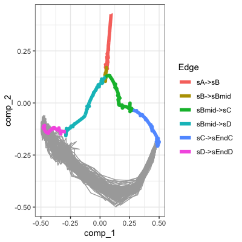
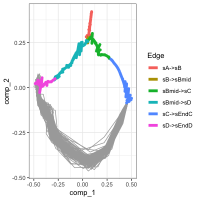

# IMCell
Computational Prediction of TF sets for Cell Fate Engineering


## Introduction
IMCell's approach is inspired by the Influence Maximization (IM) and Polarity-Related Influence Maximization (PRIM) problem. IMCell aims to find the optimal set of TFs whose collective dysregulation would maximize the activation and/or repression specific target gene sets.

We compared variations of IMCell to existing computational prediction tools which we have implemented in the [CompForce platform here][1].

[1]: https://github.com/pcahan1/compforce


1. [Setup](#setup)
2. [Example 1.1: Basic IMCell Prediction](#example1)
3. [Example 1.2: Limiting TF Scope](#example2)
4. [Example 1.3: Variations on IMCell](#example3)
5. [A brief look at the results](#oeplots)
6. [A quick aside: ranking by spread](#rankbyspread)
7. [Example 1.4: Dynamic CFE](#example_dyn)


## Setup <a name="setup"></a>
```R
devtools::install_github("pcahan1/IMCell")
library(IMCell)

```

## Example 1.1: Basic IMCell Prediction <a name="example1"></a>

### Data

Example synthetic data generated from Dyngen is available in the data folder. The network should be a dataframe with four columns: TF (i.e. regulator), TG (i.e. target gene), weight (i.e. edge weight), and type (i.e. 1 for activating and -1 for repressing interaction).

### Load data
```R
expX<-utils_loadObject("example1_synthetic_expX.rda")
sampTab<-utils_loadObject("example1_synthetic_sampTab.rda")
tfs<-utils_loadObject("example1_synthetic_TFs.rda")
grn<-utils_loadObject("example1_synthetic_grn.rda")


# > head(grn)
#          TF        TG weight type
# 1 Burn1_TF1 Burn2_TF1      1    1
# 2 Burn2_TF1 Burn3_TF1      1    1
# 3 Burn3_TF1 Burn4_TF1      1    1
# 4 Burn4_TF1    A1_TF1      1    1
# 5    A1_TF1    A2_TF1      1    1
# 6    A2_TF1    A3_TF1      1    1


```

IMCell uses igraph objects, so we can first convert the GRN from a dataframe to an igraph object with weight and type edge attributes:
```R
igrn<-igraph::graph_from_data_frame(grn,directed=TRUE)

# > igrn
# IGRAPH da39174 DNW- 132 154 -- 
# + attr: name (v/c), weight (e/n), type (e/n)
# + edges from da39174 (vertex names):

```


### Basic IMCell

IMCell requires at minimum a network structure to run. But more likely we may find specific genes that we want to activate or repress. To do so we can first run find_differential_nodes between the starting and target cell states.

For a transition in our dataset from state "sEndC" to state "sEndD" this looks like:

```R
diff_nodes<-find_differential_nodes(expX,sampTab,source="sEndC",target="sEndD",annotation_column="celltype")

# > diff_nodes
# $to_activate
#  [1] "B3_TF1"   "B4_TF1"   "B7_TF1"   "B12_TF1"  "B13_TF1"  "B14_TF1"  "D1_TF1"  
#  [8] "D2_TF1"   "D4_TF1"   "Target5"  "Target12" "Target16" "Target33" "Target37"
# [15] "Target45" "Target46" "Target48"

# $to_repress
#  [1] "B2_TF1"   "B5_TF1"   "B6_TF1"   "B9_TF1"   "B10_TF1"  "B11_TF1"  "C1_TF1"  
#  [8] "C2_TF1"   "C3_TF1"   "C4_TF1"   "C5_TF1"   "D3_TF1"   "Target1"  "Target2" 
# [15] "Target4"  "Target8"  "Target13" "Target14" "Target15" "Target19" "Target21"
# [22] "Target22" "Target34" "Target35" "Target36" "Target44" "Target49" "Target50"


``` 

Now, diff_nodes contains target genes that we want to activate and repress. We can now run IMCell like:

```R
res<-IMCell(igrn,kmax=5,targets_activate=diff_nodes$to_activate,targets_repress=diff_nodes$to_repress,
				niter=200,num_cores=2,return_spread=FALSE)

# > res
# $solution_set
# [1] "B3_TF1"

```

This can take a while. Change the number of cores by altering the num_cores parameter. To see the predicted spread (i.e. what nodes are activated and repressed, set return_spread to TRUE). Set the minimum marginal spread by setting the min_marginal_spread parameter. IMCell will stop once the marginal spread has hit this lower limit. 

In this example, only one TF's overexpression is required for the sEndC-->sEndD transition. 


## Example 1.2: Limiting TF Scope <a name="example2"></a>

Sometimes there TF search radius or network is too large. In that case, it may be helpful to first limit the TF scope. We can do this as such:

```R
tflimit<-tfscope(expX,sampTab,tfs,source="sEndC",target="sEndD",annotation_column = "celltype")

# > tflimit
# [1] "B12_TF1" "B13_TF1" "B4_TF1"  "B7_TF1"  "D1_TF1"  "B14_TF1" "B3_TF1"  "D2_TF1" 
# [9] "D4_TF1"

```

This significantly reduces the number of TFs for IMCell to search through. Now we can run IMCell as before, but limiting the TF search radius to those in tflimit:

```R
res<-IMCell(igrn,tfs=tflimit,kmax=5,targets_activate=diff_nodes$to_activate,targets_repress=diff_nodes$to_repress,
				niter=200,num_cores=2,return_spread=FALSE)

# > res
# $solution_set
# [1] "B3_TF1"

```

We achieve the same result, but in a more efficient manner.


## Example 1.3: Variations on IMCell <a name="example3"></a>

IMCell is highly customizable. Here are some examples of different variations we could run.

### IMCell_CELF: Activating edges only
In this variation, IMCell considers only activating edges in the network and ignores repressive interactions. This is in line with the original IM problem. 

```R
# limit network to activating edges only:
actgrn<-igraph::graph_from_data_frame(grn[grn$type==1,],directed=TRUE)

res<-IMCell_CELF(actgrn,kmax=5,targets=diff_nodes$to_activate,niter=200,num_cores=2,return_spread=FALSE)

# > res
# $solution_set
# [1] "B3_TF1"

```


### IMCell, repressor wins
In this variation, IMCell is run normally. However, there is a change in regulatory rules within each random cascade. Normally, should multiple edges successfully fire incident to the same target node, the winner is selected by random uniform sampling. In this variation, repressive edges take precedence, and the target node will be repressed even if other activating edges successfully fire.

```R
res<-IMCell(igrn,kmax=5,targets_activate=diff_nodes$to_activate,targets_repress=diff_nodes$to_repress,
				repressor_wins=TRUE,niter=200,num_cores=2,return_spread=FALSE)

# > res
# $solution_set
# [1] "B3_TF1"

```


### IMCell, expression weighted
In this variation, nodes (and thus spread and influence) are weighted based on expression data. Nodes can be weighted either based on target expression("target_mean_expression"), or based on a scoring metric comparing source vs. target expression ("weighted_expression_difference").

```R
res<-IMCell_expweighted(igrn,expX,sampTab,"sEndC","sEndD",
							node_weight_method="weighted_expression_difference",annotation_column="celltype",
							kmax=5,targets_activate=diff_nodes$to_activate,targets_repress=diff_nodes$to_repress,
							niter=200,num_cores=2,return_spread=FALSE)

# > res
# $solution_set
# [1] "B3_TF1"  "B14_TF1"

```
If node_weight_method is set to "no_weight", then regular IMCell is run. 


## A Brief look at the results <a name="oeplots"></a>

For the above examples, IMCell returned two different sets of TFs.
Set 1: B3_TF1 (returned by IMCell, IMCell_repressorwins, IMCell_CELF)
Set 2: B3_TF1, B14_TF1 (returned by IMCell_expweighted)


Using Dyngen, we can simulate the overexpression of these TF sets. Here the wildtype target populations are bolded in color. 100 simulatied overexpression trajectories are in gray.

Overexpression of B3_TF1:



Overexpression of B3_TF1 and B14_TF1:



## A quick aside: ranking by spread <a name="rankbyspread"></a>

IMCell is unique because instead of ranked lists, it returns optimized sets. Ranked lists suffer from a number of limitations to their utility, including that top ranked TFs may be redundant or antagonistic, while lower ranked TFs may be synergistic.
However, IMCell can rank TFs at the individual level, based on predicted spread:

```R
ranked<-rank_by_spread(igrn,targets_activate=diff_nodes$to_activate,targets_repress=diff_nodes$to_repress,niter=200)

# > ranked[1:5,]
#         TF rank
# 11  B3_TF1    1
# 23 B14_TF1    2
# 24  D1_TF1    3
# 17  B8_TF1    4
# 25  D2_TF1    5

```


## Example 1.4: Dynamic CFE <a name="example_dyn"></a>

We can also extend IMCell to a dynamic, step-wise context by integrating aspects of the Epoch GRN reconstruction package. This allows us to guide differentiation through specified intermediate states. 

This requires the Epoch package to run.

```R
require(epoch)

# load the same data
expX<-utils_loadObject("dyn_example_synthetic_expX.rda")
sampTab<-utils_loadObject("dyn_example_synthetic_sampTab.rda")
tfs<-utils_loadObject("dyn_example_synthetic_TFs.rda")
grn<-utils_loadObject("dyn_example_synthetic_grn.rda")

# Define sections of the trajectory to specify intermediate states and for this example, manually identify epochs
sampTab$edge<-paste(sampTab$from,sampTab$to,sep="_")

sampTab$epoch<-"epoch1"
sampTab$epoch[sampTab$edge %in% c("sBmid_sD","sD_sEndD")]<-"epoch2"


# Split the static trajectory into a dynamic one
dynres<-static_to_dynamic_trajectory(grn,expX,sampTab,pseudotime_column="time",epoch_annotation_column="epoch",
										path=c("sA_sB","sB_sBmid","sBmid_sD","sD_sEndD"),column_annotation="edge")


# Find targets to activate and repress
IM_targets<-find_dyn_targets(dynres, state_traj=c("sA_sB","sB_sBmid","sD_sEndD"), column_annotation="edge")
names(IM_targets)<-c("epoch1..epoch1","epoch2..epoch2")


# Run dynamic a.k.a. step-wise IMCell
res<-IMCell_epochnets(dynres$dynamic_GRN,c("epoch1..epoch1","epoch2..epoch2"),targets=IM_targets,kmax=5)
	
# > res
# $epoch1..epoch1
# $epoch1..epoch1$solution_set
# [1] "A2_TF1"


# $epoch2..epoch2
# $epoch2..epoch2$solution_set
# [1] "B8_TF1" "B3_TF1"


# Check out IMCell_epochnets_expweighted for the weighted version

```


